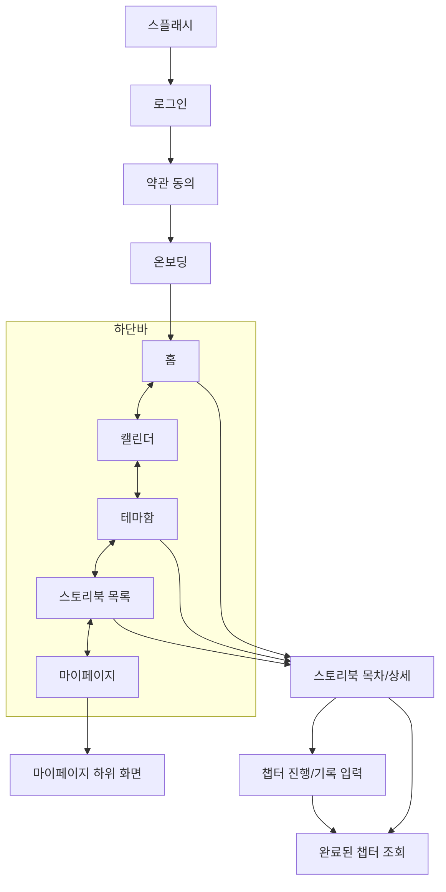

# **HALO**

> 🖼️ 자녀와 부모님이 매일 하나의 질문과 작은 행동으로 관계를 한 권의 이야기로 완성해가는 서비스
> 

## **📌 프로젝트 소개**

| 항목 | 내용 |
| --- | --- |
| **앱 이름** | HALO |
| **패키지명** | `com.umc.halo` |
| **Minimum SDK** | API 24 (Android 7.0 이상) |
| **Target SDK** | API 36 |
| **현재 기준** | 2차 과제 구현 코드 기준 |

## **👥 팀원 소개 및 역할 분담**

| 이름 | 담당 화면 / 역할 | GitHub |
| --- | --- | --- |
| **뇽/오채령** | 온보딩, 챕터 진행/기록 입력, 마이페이지 | `@chrry03` |
| **닉/김재환** | 홈, 테마함, 스토리북 목차/상세 | `@Nick9417` |
| **요시/김도엽** | 로그인/소셜 로그인, 스토리북 목록, 기록/캘린더, 완료 챕터 조회 | `@LLUPINUS` |

> `[ BGM / 알림 / 기록 감상모드 / 스토리북 내용 / 목차 내용 / 서버 연동 고도화 ]`는 후순위 또는 추가 작업 대상임.
> 

## **🛠️ 기술 스택**

| 구분 | 사용 기술 | 버전 |
| --- | --- | --- |
| **언어** | Kotlin | `2.2.10` |
| **UI** | Jetpack Compose | BOM `2026.06.00` |
| **아키텍처** | Clean Architecture + MVVM | - |
| **DI** | Hilt | `2.59.2` |
| **네트워킹** | Retrofit2 + OkHttp3 | `2.9.0` / `4.12.0` |
| **화면 이동** | Navigation Compose | `2.9.7` |
| **이미지/애니메이션** | Compose Resource, Lottie, dotLottie | `6.6.7` / `0.13.8` |
| **로컬 저장소** | DataStore | `1.0.0` |
| **소셜 로그인** | Kakao SDK, Google Credential Manager | `2.24.0` / `1.6.0` |

## **🗂️ 프로젝트 폴더 구조**

Clean Architecture에 따라 **`data` / `domain` / `presentation`** 계층을 기준으로 구성한다.

```
com.umc.halo/
│
├── core/
│   ├── common/                ← 공통 상수
│   ├── datastore/             ← 토큰 저장 DataStore
│   └── network/               ← 공통 응답 모델
│
├── data/
│   ├── remote/
│   │   ├── api/auth/          ← 인증 API
│   │   ├── auth/              ← Kakao / Google 로그인 DataSource
│   │   └── dto/               ← request / response DTO
│   └── repository/auth/       ← AuthRepository 구현체
│
├── domain/
│   ├── model/                 ← auth, calendar, home, storybook, terms, themebox 모델
│   └── repository/auth/       ← AuthRepository 인터페이스
│
├── di/                        ← Network, API, Repository, DataStore Hilt 모듈
│
├── presentation/
│   ├── base/                  ← BaseViewModel
│   ├── component/             ← 공통 UI 컴포넌트
│   ├── navigation/            ← Routes, BottomNavItem, AppNavGraph
│   ├── theme/                 ← Compose 테마/컬러/타이포
│   ├── splash/                ← 스플래시 화면
│   ├── login/                 ← 로그인 화면
│   ├── terms/                 ← 약관 동의 화면
│   ├── onboarding/            ← 온보딩 화면
│   ├── home/                  ← 홈 화면
│   ├── calendar/              ← 캘린더 화면
│   ├── themebox/              ← 테마함 화면
│   ├── storybook/             ← 스토리북 목록/상세/챕터 진행/결과
│   └── mypage/                ← 마이페이지 및 하위 화면
│
├── HaloApplication.kt
└── MainActivity.kt
```

## **🖥️ 화면 목록 & 2차 구현 현황**

### **상태 기준**

| 상태 | 의미 |
| --- | --- |
| ✅ 완료 | 화면 UI와 route 연결이 구현됨 |
| 🟡 부분 완료 | 화면 또는 route는 있으나 실제 앱 플로우, 서버 연동, 데이터 연결 등 추가 작업이 남음 |
| ⏳ 예정 | 아직 구현 필요 |

### **1차 화면 목록 기준 구현 현황**

| 화면 이름 | 스크린 ID(route) | 진입 경로 | 담당자 | 2차 구현 현황 | 비고 |
| --- | --- | --- | --- | --- | --- |
| 스플래시 | `splash` | 앱 최초 진입 | 재환 | ✅ 완료 | Lottie 스플래시 후 로그인 화면으로 이동 |
| 온보딩 | `onboarding` | 약관 동의 이후 | 채령 | ✅ 완료 | 기본 정보, 관계, 성격, 목표, 완료 단계 구현 |
| 로그인 | `login` | 스플래시 이후 / 미로그인 | 도엽 | ✅ 완료 | Kakao/Google 로그인 UI 및 구조 구현, 서버 연동 전이라 약관 화면으로 이동 |
| 홈 | `home` | 온보딩 완료 후 / 하단바 | 재환 | ✅ 완료 | 이어하기/스토리북 진입 UI 구현 |
| 스토리북 목록 | `storybook` | 하단바 | 도엽 | ✅ 완료 | 목록 UI 및 스토리북 상세 이동 구현 |
| 스토리북 목차 | `storybook_detail/{storybookId}` | 홈/테마함/스토리북 목록 → 스토리북 선택 | 재환 | ✅ 완료 | 오늘의 스토리북, 진행률, 목차 UI 및 챕터 분기 구현 |
| 챕터 진행/기록 입력 | `chapter_progress/{storybookId}/{chapterId}` | 스토리북 목차 → 미완료 챕터 선택 | 채령 | ✅ 완료 | 인트로, 질문, 감정, 장면 선택, 리뷰 등 단계형 플로우 구현 |
| 완료된 챕터 조회 | `chapter_result/{storybookId}/{chapterId}` | 스토리북 목차 → 완료 챕터 선택 / 챕터 작성 완료 | 도엽 | ✅ 완료 | 완료 기록 조회 화면 구현, 뒤로가기 시 스토리북 목차로 이동 |
| 캘린더 | `calendar` | 하단바 | 도엽 | ✅ 완료 | 월간 캘린더, 기록 모달, 월 요약 UI 구현 |
| 테마함 | `theme_box` | 하단바 | 재환 | ✅ 완료 | Empty/Filled 상태 및 스토리북 상세 이동 구현 |
| 마이페이지 | `mypage` | 하단바 | 채령 | ✅ 완료 | 홈 및 하위 설정 화면 구현 |

### **2차 과제에서 추가/확장된 화면**

| 화면 이름 | 스크린 ID(route) | 진입 경로 | 구현 현황 |
| --- | --- | --- | --- |
| 약관 동의 | `terms` | 로그인 → 약관 동의 | ✅ 완료 |
| 관계 정보 | `mypage_relationship_info` | 마이페이지 → 관계 정보 | ✅ 완료 |
| 기념일 | `mypage_anniversary` | 마이페이지 → 기념일 | ✅ 완료 |
| 시스템 설정 | `mypage_system_settings` | 마이페이지 → 시스템 설정 | ✅ 완료 |
| 알림 설정 | `mypage_notification_settings` | 마이페이지 → 알림 설정 | ✅ 완료 |
| 계정 관리 | `mypage_account_management` | 마이페이지 → 계정 관리 | ✅ 완료 |
| 계정 정보 | `mypage_account_info` | 계정 관리 → 계정 정보 | ✅ 완료 |
| 회원 탈퇴 | `mypage_withdraw` | 계정 정보 → 회원 탈퇴 | ✅ 완료 |
| 이용약관 | `mypage_terms` | 계정 관리 → 이용약관 | ✅ 완료 |
| 오픈소스 라이선스 | `mypage_open_license` | 계정 관리 → 오픈소스 라이선스 | ✅ 완료 |

## **🧭 네비게이션 플로우**



## **📐 컨벤션**

브랜치 · 커밋 · PR · 코드 네이밍 · 패키지 구조 규칙은 별도 문서를 참고.

👉 https://exuberant-light-1c4.notion.site/CONVENTION-393ca1e217c08094ad59d341fb5dfd47?source=copy_link

## **▶️ 빌드 및 실행 방법**

### **요구 사항**

- **Android Studio** 최신 안정화 버전 권장
- **JDK 17** 이상 권장
- **Android SDK**
    - Minimum SDK API 24
    - Target SDK API 36

### **실행 순서**

```bash
# 1. 레포지토리 클론
git clone <https://github.com/HALO-UMC/HALO-ANDROID.git>

# 2. Android Studio에서 프로젝트 열기
#    File > Open > 클론한 폴더 선택

# 3. Gradle Sync 진행

# 4. 에뮬레이터 또는 실제 기기를 연결한 뒤 Run 버튼으로 실행
```

### **환경 변수 / 시크릿**

소셜 로그인 키, 서명 키 비밀번호 등 민감 정보는 `local.properties`에 넣고 **Git에 올리지 않는다.**

```
# local.properties 예시
KAKAO_NATIVE_APP_KEY="..."
GOOGLE_WEB_CLIENT_ID="..."

# 릴리즈 서명용 (키스토어를 가진 사람만 필요)
KEYSTORE_FILE=...
KEYSTORE_PASSWORD=...
KEY_ALIAS=...
KEY_PASSWORD=...
```

> 
> 
> Kakao / Google 로그인 키가 없으면 빌드는 가능하지만 실제 소셜 로그인 동작은 제한될 수 있다.
> 

## **📝 남은 작업 메모**

- 로그인 성공 이후 신규/기존 사용자 분기 처리
- Kakao / Google 실제 로그인 흐름 활성화 및 서버 연동
- 서버 API 연동 후 더미/임시 데이터 제거
- 스토리북 커버 이미지, 목차/기록 실제 데이터 반영
- BGM, 알림, 기록 감상모드 등 후순위 기능 고도화
