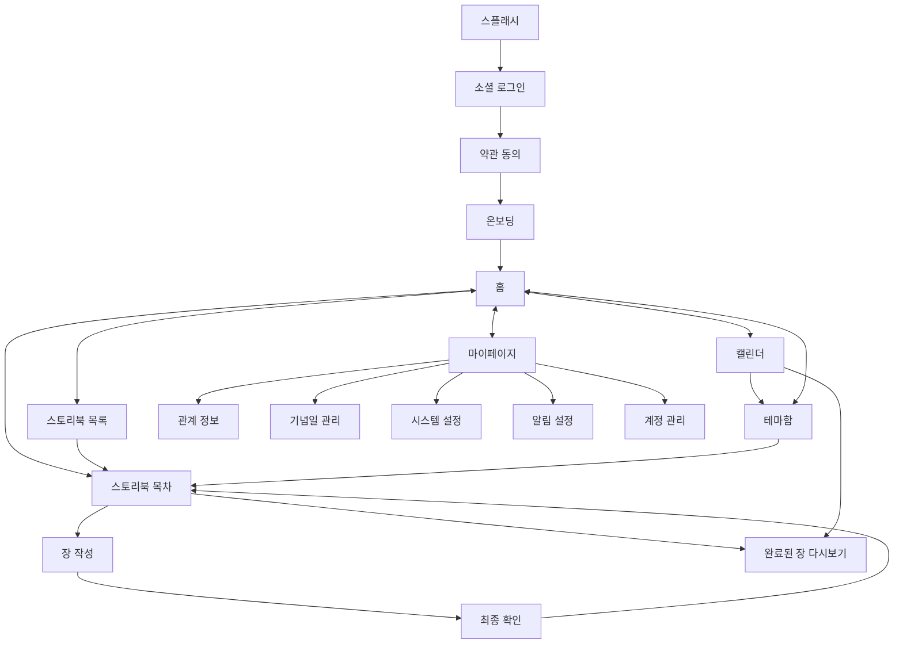

# HALO

> 자녀와 부모님이 매일 하나의 질문과 작은 행동으로 관계를 한 권의 이야기로 완성해가는 Android 서비스

## 📌 프로젝트 소개

HALO는 자녀가 부모님과의 관계를 더 깊이 이해하고 기록할 수 있도록 돕는 스토리북 기반 관계 기록 서비스입니다.
사용자는 온보딩에서 부모님과의 현재 관계와 원하는 관계 방향을 설정하고, 매일 하나의 장을 작성하며 부모님과의 이야기를 한 권의 스토리북으로 완성합니다.

| 항목 | 내용 |
| --- | --- |
| 앱 이름 | HALO |
| 패키지명 | `com.umc.halo` |
| Minimum SDK | API 24 |
| Target SDK | API 36 |
| 개발 언어 | Kotlin |
| UI | Jetpack Compose |
| 아키텍처 | Clean Architecture + MVVM |
| 서버 연동 | Retrofit / OkHttp 기반 REST API 연동 |

## 👥 팀원 소개 및 역할 분담

| 이름 | 담당 |
| --- | --- |
| 오채령 | 온보딩, 마이페이지, 기념일 관리, 스토리북 장 작성 플로우 |
| 김재환 | 홈, 스토리북 상세/목차, 테마함 |
| 김도엽 | 로그인/소셜 로그인, 스토리북 목록, 캘린더/기록 |

## 🛠️ 기술 스택

| 구분 | 사용 기술 |
| --- | --- |
| Language | Kotlin |
| UI | Jetpack Compose, Material3 |
| Architecture | Clean Architecture, MVVM |
| DI | Hilt |
| Network | Retrofit2, OkHttp3, Gson |
| Navigation | Navigation Compose |
| Local Storage | DataStore |
| Image | Coil |
| Animation | Lottie, dotLottie |
| Social Login | Kakao SDK, Google Credential Manager |
| Push | Firebase Cloud Messaging |
| BGM | Media3 ExoPlayer |

## 🗂️ 프로젝트 구조

```text
com.umc.halo
├── core
│   ├── audio              # BGM 재생 관리
│   ├── common             # 공통 상수
│   ├── datastore          # 토큰, 최근 로그인, 디바이스 UUID 저장
│   └── network            # 공통 응답, 인터셉터, 토큰 재발급 처리
│
├── data
│   ├── remote
│   │   ├── api            # API 인터페이스
│   │   ├── auth           # Kakao / Google 로그인 DataSource
│   │   └── dto            # Request / Response DTO
│   └── repository         # Repository 구현체
│
├── domain
│   ├── model              # 화면에서 사용하는 도메인 모델
│   ├── repository         # Repository 인터페이스
│   └── usecase            # UseCase
│
├── di                     # Hilt Module
├── notification           # FCM Messaging Service
└── presentation
    ├── component          # 공통 UI 컴포넌트
    ├── navigation         # AppNavGraph / Route / BottomNav
    ├── theme              # 디자인 시스템
    ├── splash             # 스플래시
    ├── login              # 로그인
    ├── terms              # 약관
    ├── onboarding         # 온보딩
    ├── home               # 홈
    ├── storybook          # 스토리북 목록/목차/장 작성/완료 장 조회
    ├── calendar           # 캘린더
    ├── themebox           # 테마함
    └── mypage             # 마이페이지/설정/기념일
```

## ✨ 주요 기능

### 1. 인증 및 진입 플로우

- Kakao 로그인
- Google 로그인
- JWT Access Token / Refresh Token 기반 인증
- 토큰 만료 시 재발급 처리
- 최근 로그인 방식 저장
- 약관 동의 여부 및 온보딩 완료 여부에 따른 진입 분기

### 2. 약관

- 약관 목록 조회
- 필수 약관 동의 여부에 따른 다음 버튼 활성화
- 약관 상세 웹 링크 연결
- 앱 재진입 시 약관 단계 복원

### 3. 온보딩

- 닉네임 입력 및 중복 확인
- 닉네임 조건 실시간 검증
- 성별 및 생년월일 입력
- 부모님 성격 태그 선택
- 현재 관계 상태 선택
- 원하는 관계 방향 선택
- 단계별 서버 저장
- 중간 이탈 후 진행 단계 및 입력값 복원

### 4. 홈

- 사용자 이름 기반 홈 화면
- 진행 중인 스토리북 이어쓰기
- 온보딩 태그 기반 추천 스토리북
- 행동 가이드 제공
- BGM 플레이어 표시 및 재생 상태 유지

### 5. 스토리북

- 전체 / 진행중 / 완료 스토리북 목록 조회
- 스토리북 상세 및 목차 조회
- 진행률, 장 잠금/완료/오늘 작성 가능 상태 표시
- 스토리북 시작하기
- 완료된 스토리북은 테마함으로 연결

### 6. 스토리북 장 작성

- 오늘 작성 가능한 장 조회
- 장 인트로 화면
- 행동 가이드 화면
- 질문 3개 답변 작성
- 사진 업로드 또는 장면카드 선택
- 감정 카드 선택
- 최종 확인 후 완료 저장
- 단계별 임시저장
- 임시저장 데이터 재진입 복원
- 완료된 장 다시보기
- 캘린더에서 완료된 장 조회 연결

### 7. 이미지 업로드

- Presigned URL 발급
- S3 직접 업로드
- KMS 암호화 필수 헤더 적용
- 업로드 후 `imageKey` 기반 장 기록 저장
- DRAFT 저장 후 `imageUrl` / `imageKey` 복원

### 8. 캘린더

- 월별 기록 조회
- 기록이 있는 날짜 표시
- 일별 기록 조회
- 완료된 스토리북 및 완료된 장 기록 표시
- 완료된 장 클릭 시 다시보기 화면 이동
- 완료된 스토리북 클릭 시 테마함 이동

### 9. 테마함

- 완료된 스토리북 캐릭터 카드 조회
- Empty / Filled 상태 처리
- 완성된 스토리북 감상 화면 연결
- 스토리북별 장 기록 감상

### 10. 마이페이지

- 내 정보 조회
- 관계 정보 조회
- 시스템 설정
- BGM 설정 조회/수정
- 알림 설정 조회/수정
- 계정 정보 조회
- 로그아웃
- 회원 탈퇴
- 이용 약관
- 오픈소스 라이선스

### 11. 기념일 관리

- 기념일 목록 조회
- 다가오는 기념일 조회
- 개인 기념일 추가
- 개인 기념일 수정
- 개인 기념일 삭제
- 공용 기념일 상세 조회
- 개인/공용 기념일 상세 화면 분기
- D-Day 기준 정렬 및 D-7 이내 표시
- 음력 날짜 등록 및 표시용 양력 날짜 반영

## 🧭 주요 플로우



## 📡 API 연동

HALO Android는 화면에서 직접 API를 호출하지 않고, 아래 구조를 통해 서버와 통신합니다.

```text
Presentation
  → ViewModel
  → Domain Repository Interface
  → Data Repository Implementation
  → Remote API / DTO
```

### 연동된 주요 API

| 도메인 | API |
| --- | --- |
| Auth | 로그인, 토큰 재발급, 로그아웃 |
| Member | 내 정보 조회, 회원 탈퇴, 접속 시간 갱신 |
| Terms | 약관 목록 조회, 약관 동의 처리, 약관 동의 여부 조회 |
| Onboarding | 닉네임 중복 확인, 온보딩 저장, 온보딩 상태 조회, 태그 목록 조회 |
| Home | 홈 화면 조회 |
| Storybook | 목록 조회, 상세 조회, 시작하기, 추천 스토리북 조회 |
| Chapter | 오늘의 장 조회, 장 기록 작성, 완료된 장 다시보기 |
| Image | Presigned URL 발급, S3 업로드 |
| Calendar | 월별 기록 조회, 일별 기록 조회 |
| ThemeBox | 테마함 캐릭터 조회, 스토리북 감상 조회 |
| Relationship | 관계 정보 조회 |
| Anniversary | 목록 조회, 추가, 수정, 삭제 |
| Notification | 알림 설정 조회/수정 |
| BGM | BGM 설정 조회/수정 |

## ⚠️ 에러 처리

공통 응답 구조와 서버 에러 코드를 기준으로 사용자 피드백을 처리합니다.

- 네트워크 실패 시 토스트 또는 실패 UI 표시
- 서버 에러 메시지 파싱 후 사용자에게 안내
- 입력 검증 실패 시 필드별 메시지 표시
- 401 인증 오류 시 기존 인증 흐름으로 처리
- 403/404/409 등 도메인 에러는 화면 유지 또는 이전 화면 이동
- 장 작성, 기념일, 알림, 온보딩 등 주요 입력 플로우에서 실패 시 재시도 가능 상태 유지

## 🎨 UI/UX

- Figma 디자인 기준으로 화면 구현
- 공통 TopBar / BottomNavigation / Button / Loading / Error 컴포넌트 사용
- 디자인 시스템 색상과 타이포그래피 적용
- 입력값 유효성에 따른 버튼 활성/비활성 처리
- 로딩/빈 목록/실패 상태 UI 제공
- Edge-to-edge 화면 적용
- 실제 기기 대응을 위한 Safe Area 및 스크롤 처리

## ▶️ 실행 방법

### 요구 사항

- Android Studio 최신 안정화 버전 권장
- JDK 17 이상
- Android SDK
    - Minimum SDK 24
    - Target SDK 36

### 실행 순서

```bash
git clone https://github.com/HALO-UMC/HALO-ANDROID.git
```

1. Android Studio에서 프로젝트를 연다.
2. `local.properties`에 필요한 환경 값을 설정한다.
3. Firebase 사용을 위해 `google-services.json`을 `app/` 하위에 추가한다.
4. Gradle Sync를 진행한다.
5. 에뮬레이터 또는 실제 기기에서 실행한다.

### local.properties 예시

```properties
sdk.dir=...

BASE_URL=https://dev.halo-app.co.kr/
KAKAO_NATIVE_APP_KEY=...
GOOGLE_WEB_CLIENT_ID=...

KEYSTORE_FILE=...
KEYSTORE_PASSWORD=...
KEY_ALIAS=...
KEY_PASSWORD=...
```

## ✅ 빌드 확인

```bash
./gradlew :app:compileDebugKotlin
```

## 📱 시연 핵심 플로우

1. 소셜 로그인
2. 약관 동의
3. 온보딩 진행 및 중간 복원
4. 홈 화면 추천 스토리북 확인
5. 스토리북 목록/목차 확인
6. 오늘의 장 작성
7. 사진 업로드 또는 장면카드 선택
8. 감정 선택 및 최종 저장
9. 완료된 장 다시보기
10. 캘린더 일별 기록 확인
11. 테마함에서 완료 스토리북 확인
12. 마이페이지 관계 정보/설정/BGM/알림 확인
13. 기념일 추가/수정/삭제
14. 로그아웃 및 회원 탈퇴

## 📎 컨벤션

브랜치, 커밋, PR, 네이밍 컨벤션은 팀 컨벤션 문서를 따릅니다.

- 기능 단위 브랜치 사용
- 의미 있는 단위의 커밋 작성
- Presentation / Domain / Data 계층 분리
- DTO와 화면 모델 분리
- 공통 UI 컴포넌트 재사용

## 🏁 최종 구현 범위

- 전체 핵심 화면 UI 구현
- 주요 사용자 플로우 연결
- 서버 API 연동
- 소셜 로그인 연동
- 토큰 저장 및 재발급 처리
- 이미지 업로드 연동
- 입력 검증 및 에러 처리
- 실제 기기 UI 대응
- 최종 과제 시연 가능한 기능 완성
