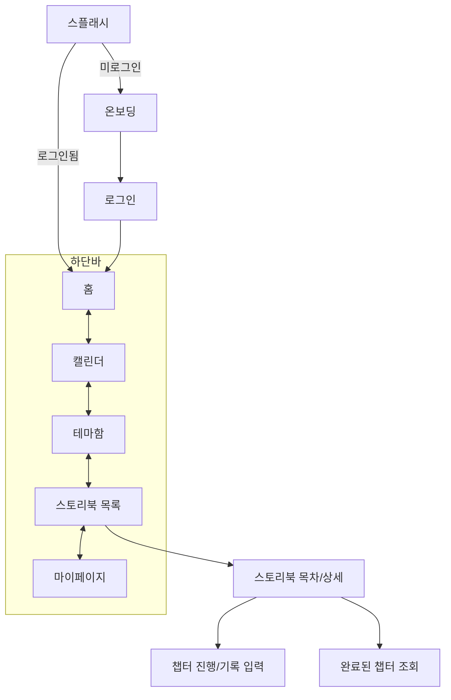

> 🖼️ 자녀와 부모님이 매일 하나의 질문과 작은 행동으로 관계를 한 권의 이야기로 완성해가는 서비스
> 

## **📌 프로젝트 소개**

| 항목 | 내용 |
| --- | --- |
| **앱 이름** | HALO |
| **패키지명** | `com.umc.halo` |
| **Minimum SDK** | API 24 (Android 7.0 이상) |

## **👥 팀원 소개 및 역할 분담**

| 이름 | 담당 화면 / 역할 | GitHub |
| --- | --- | --- |
| **뇽/오채령** | 온보딩(소셜 로그인 제외), 스토리북 상세(기본 골격), 마이페이지 | `@chrry03` |
| **닉/김재환** | 홈, 테마함, 목차(기본 골격) | `@Nick9417` |
| **요시/김도엽** | 온보딩(소셜 로그인), 스토리북, 기록 | `@LLUPINUS` |

> `[ BGM / 알림 / 기록 감상모드 / 스토리북 내용 / 목차 내용 ]` 은 후순위 작업임.
> 

## **🛠️ 기술 스택**

| 구분 | 사용 기술 | 버전 |
| --- | --- | --- |
| **언어** | Kotlin | - |
| **UI** | Jetpack Compose | - |
| **아키텍처** | Clean Architecture + MVVM | - |
| **DI** | Hilt | `2.59.2` |
| **네트워킹** | Retrofit2 + OkHttp3 | `2.9.0` / `4.12.0` |
| **화면 이동** | Navigation Compose | `2.9.7` |
| **이미지 로딩** | Coil | - |
| **로컬 저장소** | DataStore | `1.0.0` |

## **🗂️ 프로젝트 폴더 구조**

Clean Architecture에 따라 **`data` / `domain` / `presentation`** 세 개의 큰 계층으로 나눈다.

```
com.umc.halo/
│
├── data/                      ← 데이터를 실제로 가져오는 곳
│   ├── remote/
│   │   ├── api/               ← Retrofit API 인터페이스
│   │   └── dto/               ← 서버와 주고받는 데이터 모양
│   │       ├── request/       ← 서버로 보내는 요청 DTO
│   │       └── response/      ← 서버에서 받는 응답 DTO
│   └── repository/            ← repository "구현체" (XxxRepositoryImpl)
│
├── domain/                    ← 약속(규칙)만 정의
│   ├── model/                 ← 순수 도메인 모델 (선택)
│   ├── repository/            ← repository 인터페이스
│   └── usecase/               ← 유스케이스 (선택, 필요할 때만)
│
├── presentation/              ← 화면 : 프론트엔드 담당 영역
│   ├── navigation/            ← 화면 이동 정의 (Navigation Compose, NavGraph, Route)
│   ├── theme/                 ← Compose 색상·테마·폰트
│   ├── base/                  ← BaseScreen, BaseViewModel, UiState, UiEvent
│   ├── component/             ← 공통 UI 컴포넌트 (Button, Card, Chip 등)
│   ├── splash/                ← 스플래시 화면
│   ├── onboarding/            ← 온보딩 화면
│   ├── login/                 ← 로그인 화면
│   ├── home/                  ← 하단바: 홈 화면
│   ├── calendar/              ← 하단바: 캘린더 화면
│   ├── themebox/              ← 하단바: 테마함 화면
│   ├── storybook/             ← 하단바: 스토리북 + 스토리북 내부 진행 화면
│   │   ├── list/              ← 스토리북 목록 화면
│   │   ├── detail/            ← 스토리북 목차/상세 정보 화면
│   │   └── chapter/           ← 스토리북 챕터 관련 화면
│   │       ├── progress/      ← 챕터 진행/기록 입력 화면
│   │       └── result/        ← 완료된 챕터 조회 화면
│   └── mypage/                ← 하단바: 마이페이지 화면
│
├── di/                        ← Hilt 모듈 (RetrofitModule, ApiModule, RepositoryModule)
│
├── core/                      ← 앱 전반에서 사용하는 공통 코드
│   ├── common/                ← 공통 유틸, 확장함수, 상수
│   ├── network/               ← 공통 응답 모델, 네트워크 에러 처리, 인터셉터
│   └── datastore/             ← 로컬 저장소 관련 코드 (DataStore 등)
│
└── MainActivity.kt            ← 앱 진입점
```

> ⚠️ 각 화면 패키지는 `Screen`, `ViewModel`, `UiState`, `UiEvent` 로 구성하며 `Base`를 상속/래핑해 사용함.
> 

## **🖥️ 화면 목록 & 플로우**

### **화면 목록**

| 화면 이름 | 스크린 ID (route) | 진입 경로 | 담당자 |
| --- | --- | --- | --- |
| 스플래시 | `splash` | 앱 최초 진입 | 채령 |
| 온보딩 | `onboarding` | 첫 실행 & 미로그인 | 채령 |
| 로그인 | `login` | 온보딩 이후 | 도엽 |
| 홈 | `home` | 로그인 완료 후 / 하단바 | 재환 |
| 스토리북 목록 | `storybook` | 하단바 | 도엽 |
| 스토리북 목차 | `storybook_detail/{storybookId}` | 스토리북 목록 → 항목 선택 | 재환 |
| 챕터 진행/기록 입력 | `chapter_progress/{storybookId}/{chapterId}` | 스토리북 상세 → 챕터 선택 | 채령 |
| 완료된 챕터 조회 | `chapter_result/{storybookId}/{chapterId}` | 완료된 챕터 선택 | 도엽(기록) |
| 캘린더 | `calendar` | 하단바 | 도엽 |
| 테마함 | `theme_box` | 하단바 | 재환 |
| 마이페이지 | `mypage` | 하단바 | 채령 |

### **네비게이션 플로우**



## **📐 컨벤션**

브랜치 · 커밋 · PR · 코드 네이밍 · 패키지 구조 규칙은 별도 문서를 참고.

👉 CONVENTION 

## **▶️ 빌드 및 실행 방법**

### **요구 사항**

- **Android Studio** (최신 안정화 버전 권장)
- **JDK 17** 이상
- **Android SDK** — Minimum SDK API 24 (Android 7.0)

### **실행 순서**

```bash
# 1. 레포지토리 클론
git clone https://github.com/HALO-UMC/HALO-ANDROID.git

# 2. Android Studio에서 프로젝트 열기
#    File > Open > 클론한 폴더 선택

# 3. Gradle Sync 오류 시 수동으로 진행

# 4. 에뮬레이터 또는 실제 기기를 연결한 뒤 ▶ Run 버튼으로 실행
```

### **환경 변수 / 시크릿**

Base URL, 소셜 로그인 키 등 민감 정보는 `local.properties` 에 넣고 **Git에 올리지 않는다.**

```
# local.properties 예시
BASE_URL="https://..."
KAKAO_NATIVE_APP_KEY="..."
```
